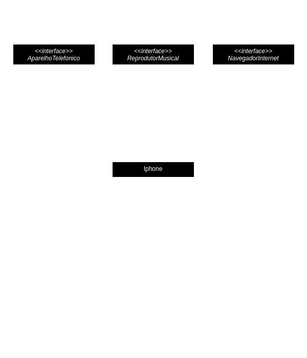

# 📱 Diagramação de classes do iPhone

## 📋 Descrição
Neste repositório, você encontrará uma implementação abrangente de um desafio de modelagem de software que tem como objetivo representar de forma detalhada e precisa as funcionalidades de um iPhone. Este projeto utiliza princípios de programação orientada a objetos e técnicas de modelagem UML para criar uma estrutura robusta e versátil que permite que um dispositivo iPhone desempenhe os três papéis distintos e cruciais: Reprodutor Musical, Aparelho Telefônico e Navegador na Internet.

Este repositório não apenas fornece o código-fonte em Java para as classes e interfaces correspondentes, mas também inclui uma documentação completa, insights de design e instruções detalhadas sobre como executar o código e explorar o diagrama UML associado. Ao explorar este projeto, eu tive a oportunidade de aprender e aplicar melhores práticas de engenharia de software, desenvolvendo um entendimento profundo de como a modelagem e a programação orientada a objetos podem ser utilizadas para criar sistemas complexos e funcionais.

## 📊 Diagrama UML

  

Nesta seção, apresentamos uma explicação detalhada de cada classe representada no diagrama de classe do projeto. Cada classe desempenha um papel específico e contribui para a funcionalidade global do sistema.

### `iPhone`

A classe `iPhone` é a classe principal que representa o dispositivo como um todo. Ela implementa as interfaces `ReprodutorMusical`, `AparelhoTelefonico` e `NavegadorInternet`. Isso permite que o iPhone desempenhe os papéis de reprodutor musical, aparelho telefônico e navegador na Internet. 

### `ReprodutorMusical`

A interface `ReprodutorMusical` define os métodos necessários para controlar a reprodução de música, como `tocar()`, `pausar()` e `selecionarMusica()`. As classes que implementam essa interface são capazes de reproduzir músicas.

### `AparelhoTelefonico`

A interface `AparelhoTelefonico` define os métodos para realizar chamadas telefônicas e enviar mensagens, incluindo `ligar()`, `atender()` e `iniciarCorreioVoz()`. As classes que implementam essa interface podem funcionar como dispositivos telefônicos.

### `NavegadorInternet`

A interface `NavegadorInternet` define métodos para a navegação na web, como `exibirPagina()`, `adicionarNovaAba()` e `atualizarPagina()`. As classes que implementam essa interface podem atuar como navegadores da Internet.

Cada classe ou interface desempenha um papel específico no sistema e contribui para a versatilidade do dispositivo iPhone, tornando-o capaz de realizar uma variedade de funções.

Se você deseja explorar mais detalhes do diagrama de classes [clique aqui](docs/iPhone-modelagem.pdf) para ser redirecionado ao arquivo PDF correspondente.

## 💡 Como usar
Clone o repositório em sua máquina local usando o comando git clone.
Abra o projeto em sua IDE Java preferida.
Explore o código-fonte e o diagrama UML para entender como as classes estão relacionadas e como cada papel é implementado.
Consulte o README.md para informações detalhadas sobre o desafio, escolhas de design e instruções para execução.

Este repositório foi uma valiosa fonte de aprendizado para mim, em busca de aprofundar seus conhecimentos em modelagem de software, programação orientada a objetos e design de sistemas de software complexos.
